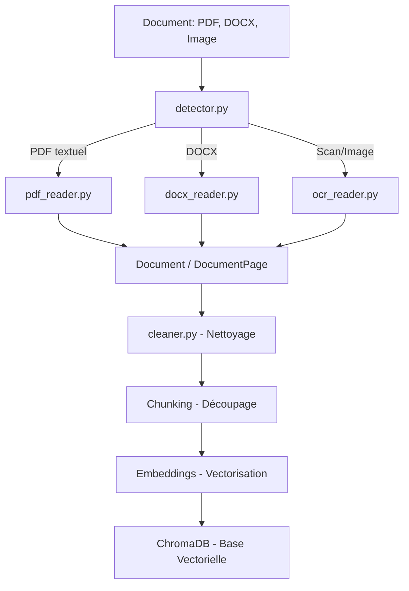
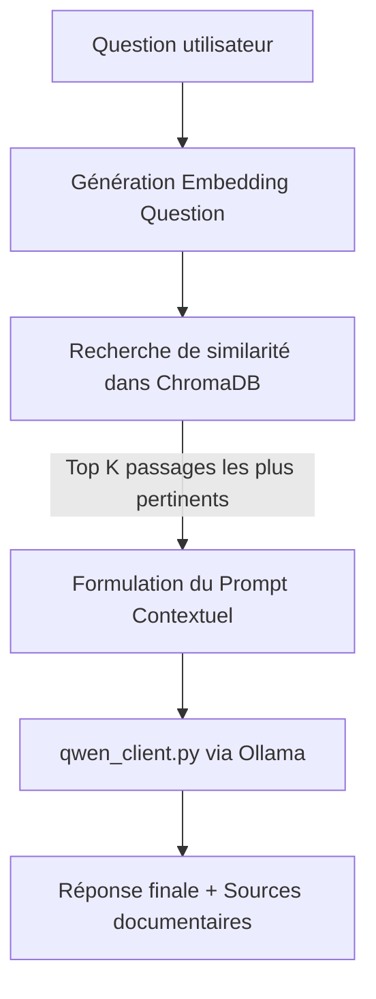

# 🤖 Assistant AI - Recherche Documentaire & RAG 100% Local

Ce projet est une solution de recherche documentaire intelligente exploitant des modèles d'Intelligence Artificielle (IA) locaux. L'objectif principal est de concevoir un système capable d'importer des documents multi-formats (PDF, Word, Images), d'en extraire le contenu textuel (avec OCR si nécessaire), de l'indexer de manière sémantique, et de répondre aux questions des utilisateurs de façon contextualisée et 100% locale (sans connexion internet ni cloud).

---

## 🗺️ Roadmap & État d'avancement des Étapes

L'architecture finale s'articule autour de 7 étapes clés :

### Étape 1 : Client LLM Local ↔ Ollama 
* **Statut** : **Terminé** ✅
* **Description** : Mise en place de l'orchestration du modèle local `qwen3:4b` (ou Qwen 2.5) via Ollama pour répondre aux questions.

### Étape 2 : Extraction et Détection Automatique 
* **Statut** : **En cours (Finalisation)** 🔄
* **Description** : Lecture des PDF (textuels), fichiers Word (DOCX) et détection automatique du format. Initialisation de la brique OCR (PaddleOCR) pour les fichiers scannés et les images.

### Étape 3 : Nettoyage du texte 
* **Statut** : **Implémenté** ✅
* **Description** : Suppression du bruit (caractères spéciaux, sauts de ligne inutiles, espaces superflus) pour améliorer l'indexation. Le nettoyage modifie directement le texte des pages du `Document`.

### Étape 4 : Découpage sémantique (Chunking) 
* **Statut** : **Planifié** ⏳
* **Description** : Découpage des textes volumineux en blocs (chunks) de taille homogène avec chevauchement (overlap) pour conserver le contexte.

### Étape 5 : Embeddings (Vectorisation) 
* **Statut** : **Planifié** ⏳
* **Description** : Transformation de chaque bloc de texte en vecteur numérique représentant son sens sémantique.

### Étape 6 : Base de données vectorielle (ChromaDB) 
* **Statut** : **Planifié** ⏳
* **Description** : Stockage persistant local des embeddings et recherche rapide par similarité cosinus.

### Étape 7 : Pipeline de requêtage RAG 
* **Statut** : **Planifié** ⏳
* **Description** : Intégration de la question utilisateur -> Recherche des blocs pertinents -> Envoi du contexte au LLM -> Génération de la réponse finale avec citation des sources.

---

## 🏗️ Architecture Détaillée du Système

> Pour une documentation d'architecture plus détaillée, voir [ARCHITECTURE.md](ARCHITECTURE.md).


### Diagramme de flux d'ingestion (Indexation)


### Diagramme de flux de requêtage (Query Pipeline)


---

## 📄 Documentation Fichier par Fichier

Voici la description précise du rôle de chaque fichier actuellement présent dans l'espace de travail :

### 1. Dossier Racine

*   **[main.py](file:///C:/Users/merie_luskpw8/Documents/AssistantAI/main.py)**  
    *   **Description** : Point d'entrée de l'application. Utilisé pour tester rapidement l'extraction en affichant le contenu extrait d'un fichier PDF de démonstration.
*   **[requirements.txt](file:///C:/Users/merie_luskpw8/Documents/AssistantAI/requirements.txt)**  
    *   **Description** : Fichier contenant les dépendances Python requises pour le projet (ex. `pymupdf`, `python-docx`, `paddleocr`, `ollama`, `chromadb`, etc.).

### 2. Modèles de données (`app/models/`)

*   **[app/models/document.py](file:///C:/Users/merie_luskpw8/Documents/AssistantAI/app/models/document.py)**  
    *   **Description** : Contient les structures de données en `dataclass` qui circulent à travers le pipeline.
    *   **Classes majeures** :
        *   `DocumentPage` : Représente une page avec son `page_number` (int) et son `text` (str).
        *   `Document` : Structure racine représentant un fichier entier, contenant un `filename` (nom du fichier), un `id` unique (UUID4), une liste de `DocumentPage`, et un dictionnaire de `metadata` (ex: type de fichier, nombre de pages).
        *   `Chunk` : Prévu pour les étapes futures afin de stocker les fragments de texte avec leur source.

### 3. Module d'Extraction (`app/extraction/`)

*   **[app/extraction/pdf_reader.py](file:///C:/Users/merie_luskpw8/Documents/AssistantAI/app/extraction/pdf_reader.py)**  
    *   **Description** : Module d'extraction de texte pour les PDF textuels.
    *   **Technologie** : `PyMuPDF` (importé via `fitz`).
    *   **Fonction** : `extract_text_from_pdf(filePath: str) -> Document`. Parcourt chaque page du document PDF, extrait le texte brut nettoyé des espaces superflus, et remplit l'objet `Document`.
*   **[app/extraction/docx_reader.py](file:///C:/Users/merie_luskpw8/Documents/AssistantAI/app/extraction/docx_reader.py)**  
    *   **Description** : Module d'extraction de texte pour les documents Word `.docx`.
    *   **Technologie** : `python-docx`.
    *   **Fonction** : `extract_text_from_docx(file_path: str) -> Document`. Parcourt l'ensemble des paragraphes non vides du document, les regroupe dans une seule page logique (`page_number=1`), et renvoie l'objet `Document`.
*   **[app/extraction/ocr_reader.py](file:///C:/Users/merie_luskpw8/Documents/AssistantAI/app/extraction/ocr_reader.py)**  
    *   **Description** : Module de reconnaissance optique de caractères (OCR) pour les documents scannés ou images.
    *   **Technologie** : `PaddleOCR` (configuré pour la langue française `lang="fr"`).
    *   **État** : L'instance `ocr` est initialisée. La fonction finale d'extraction reste à implémenter.
*   **[app/extraction/detector.py](file:///C:/Users/merie_luskpw8/Documents/AssistantAI/app/extraction/detector.py)**  
    *   **Description** : Routeur intelligent du module d'extraction.
    *   **Fonction** : `load_document(file_path: str) -> Document`. Analyse l'extension du fichier en minuscule (ex. `.pdf`, `.docx`) et redirige automatiquement l'appel vers la bonne fonction d'extraction (`extract_text_from_pdf` ou `extract_text_from_docx`).
*   **[app/extraction/extraction_service.py](file:///C:/Users/merie_luskpw8/Documents/AssistantAI/app/extraction/extraction_service.py)**  
    *   **Description** : Squelette vide destiné à orchestrer plus tard les services d'extraction à un plus haut niveau (par exemple pour l'API FastAPI).

### 4. Module LLM (`app/llm/`)

*   **[app/llm/qwen_client.py](file:///C:/Users/merie_luskpw8/Documents/AssistantAI/app/llm/qwen_client.py)**  
    *   **Description** : Client de connexion locale pour interagir avec le modèle d'IA de génération.
    *   **Technologie** : `ollama`.
    *   **Fonction** : `ask_qwen(question: str) -> str`. Envoie une invite au modèle local `qwen3:4b` et retourne sa réponse textuelle sous forme de chaîne de caractères.

### 5. Module de Nettoyage (`app/cleaning/`)

*   **[app/cleaning/cleaner.py](file:///C:/Users/merie_luskpw8/Documents/AssistantAI/app/cleaning/cleaner.py)**  
    *   **Description** : Fichier vide (squelette) destiné à héberger les règles de nettoyage linguistique et textuel lors de l'Étape 3.

### 6. Suite de Tests (`tests/`)

*   **[tests/test_paddle.py](file:///C:/Users/merie_luskpw8/Documents/AssistantAI/tests/test_paddle.py)** : Vérifie le bon chargement de la bibliothèque `paddle`, sa version et la détection CUDA ou CPU.
*   **[tests/test_ocr.py](file:///C:/Users/merie_luskpw8/Documents/AssistantAI/tests/test_ocr.py)** : Effectue une prédiction brute de texte avec `PaddleOCR` sur l'image de test `documents/images/images.jpg` pour valider le fonctionnement de la brique de reconnaissance.
*   **[tests/test_pdf.py](file:///C:/Users/merie_luskpw8/Documents/AssistantAI/tests/test_pdf.py)** : Teste l'extraction d'un fichier PDF volumineux (`50_pages.pdf`). *Note : Fait actuellement référence à un nom de fonction temporaire `extract_pdf_text`.*
*   **[tests/test_docx.py](file:///C:/Users/merie_luskpw8/Documents/AssistantAI/tests/test_docx.py)** : Valide l'extraction de texte sur le fichier Word `HAMRI_MERIEM_Demande_de_Stage.docx` et affiche la sortie structurée.
*   **[tests/test_detector.py](file:///C:/Users/merie_luskpw8/Documents/AssistantAI/tests/test_detector.py)** : Valide le chargement via `load_document` sur le fichier `final.pdf` et vérifie la structure de données renvoyée.

---

## 🛠️ Comment Exécuter les Tests

Pour s'assurer du bon fonctionnement de chaque composant, vous pouvez exécuter individuellement les scripts de tests à la racine du projet :

```bash
# Pour tester la détection matérielle de Paddle
python tests/test_paddle.py

# Pour tester l'OCR de Paddle OCR sur une image
python tests/test_ocr.py

# Pour tester l'extraction d'un fichier DOCX
python tests/test_docx.py

# Pour tester le détecteur automatique
python tests/test_detector.py
```